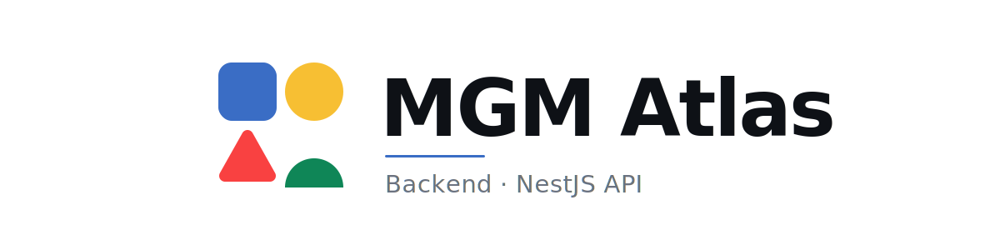
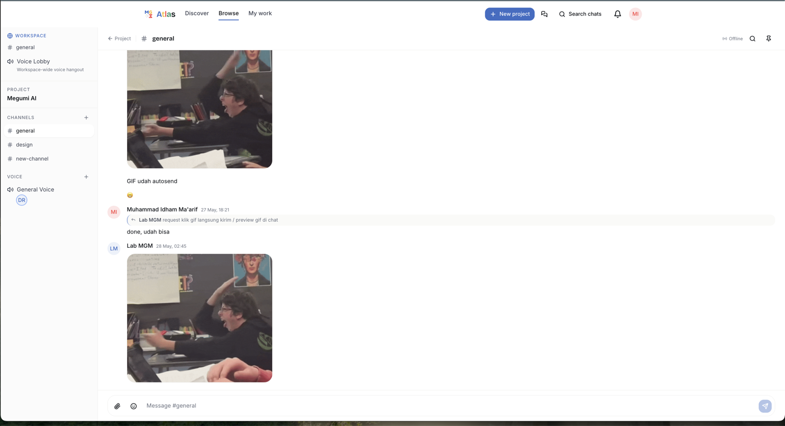
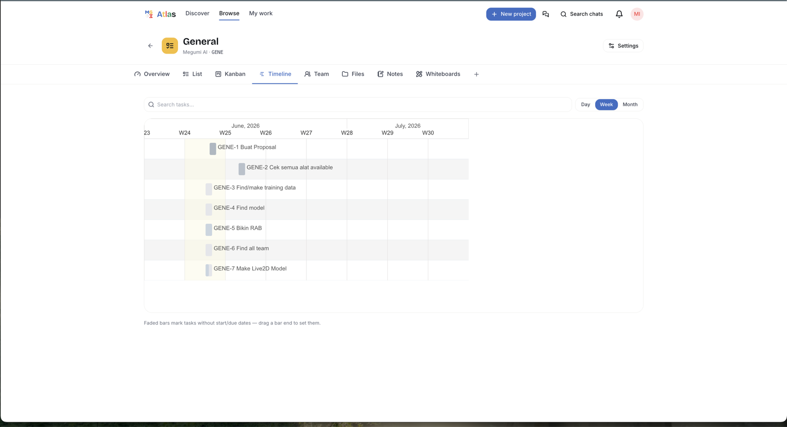
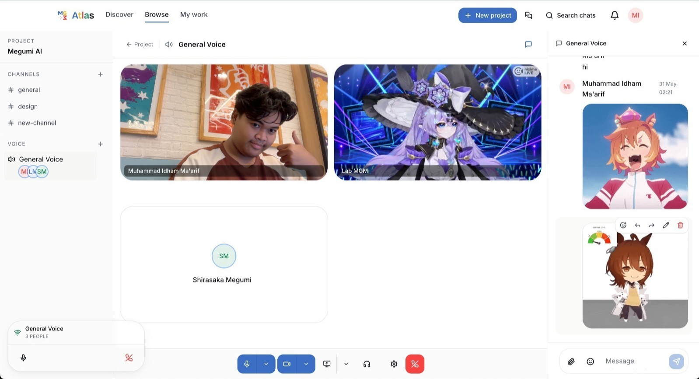
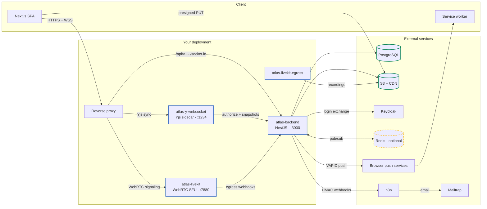
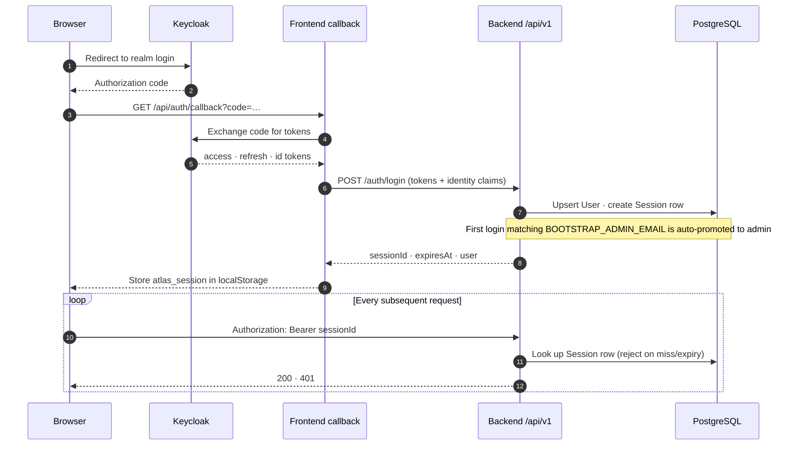
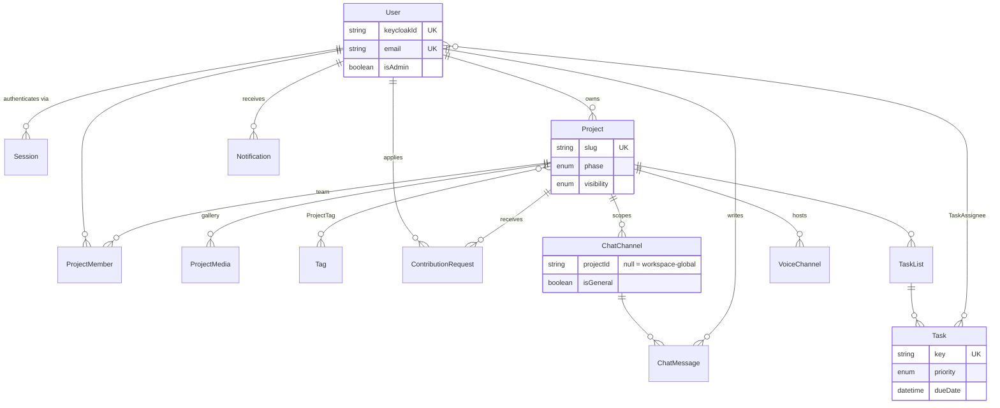
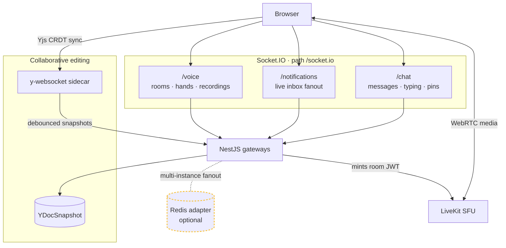
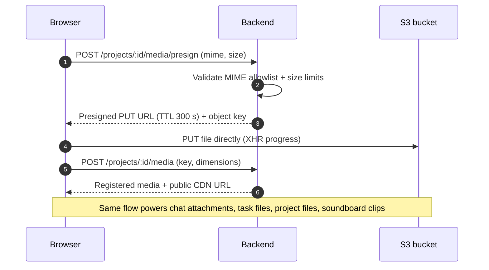

<a id="readme-top"></a>

<div align="center">

<picture>
  <source media="(prefers-color-scheme: dark)" srcset="docs/brand/banner-dark.svg">
  
</picture>

<p><em>The engine behind MGM Atlas — one NestJS API for portfolio, chat, PMO, voice, and notifications.</em></p>

<p>
  <a href="https://github.com/MGM-Laboratory/mgm-atlas-backend/actions/workflows/ci.yml"></a>
  <a href="https://github.com/MGM-Laboratory/mgm-atlas-backend/actions/workflows/production.yml"></a>
  <a href="https://atlas.labmgm.org/api/v1/health"></a>
  <a href="LICENSE"></a>
</p>

<p>
  <a href="https://nestjs.com"></a>
  <a href="https://www.prisma.io"></a>
  <a href="https://www.postgresql.org"></a>
  <a href="https://socket.io"></a>
  <a href="https://livekit.io"></a>
  <a href="https://www.typescriptlang.org"></a>
</p>

<p>
  <a href="#-architecture"><strong>Architecture</strong></a> ·
  <a href="#-authentication">Authentication</a> ·
  <a href="#-api-surface">API Surface</a> ·
  <a href="#-data-model">Data Model</a> ·
  <a href="#-realtime-topology">Realtime</a> ·
  <a href="#-getting-started">Getting Started</a> ·
  <a href="https://github.com/MGM-Laboratory/mgm-atlas-frontend">Frontend App ↗</a>
</p>

</div>

---

## 🛰 Overview

**MGM Atlas** is the self-hosted project HQ of [MGM Laboratory](https://mgm.ub.ac.id) (Universitas Brawijaya): a project portfolio with Netflix-style discovery, Slack-style chat, a ClickUp-style PMO, and Discord-style voice — in one app, so the lab doesn't have to pay for Jira *and* Slack. The product tour with all the screenshots lives in the [frontend repository](https://github.com/MGM-Laboratory/mgm-atlas-frontend#readme).

**This repository is the API** that powers all of it: a NestJS 10 service exposing REST under `/api/v1` plus three Socket.IO namespaces, organized into **15 feature modules, 41 controllers, and 48 Prisma models** on PostgreSQL. Interactive Swagger docs are served at `/api/v1/docs` in non-production environments.

| | | |
|:---:|:---:|:---:|
|  |  |  |
| *Chat with attachments & previews* | *PMO Gantt timelines* | *Voice, video & screen share* |

<p align="center"><sub>A few things this API powers — see the <a href="https://github.com/MGM-Laboratory/mgm-atlas-frontend#-feature-tour">full feature tour</a>.</sub></p>

## 🏗 Architecture



The API is one container, but voice, collaborative editing, and recording each run as sidecars that the backend orchestrates. Everything degrades gracefully: no Redis means single-instance sockets, no y-websocket means single-editor notes, no LiveKit means voice endpoints answer `503` — the core portfolio API never goes down with a sidecar.

| Compose service | Role | Port |
|---|---|---|
| `atlas-backend` | This NestJS API (auto-runs `prisma migrate deploy` on boot) | `3000` |
| `atlas-y-websocket` | Yjs CRDT relay for collaborative notes & whiteboards | `1234` |
| `atlas-livekit` | WebRTC SFU for voice/video/screen share | `7880` + UDP/TCP media mux |
| `atlas-livekit-egress` | Records voice channels and uploads composites to S3 | — |

> [!NOTE]
> **PostgreSQL is always external** — docker-compose runs the app containers only, never a database.

<p align="right">(<a href="#readme-top">back to top</a>)</p>

## 🔐 Authentication

Keycloak handles *identity*; this API issues its own *sessions*. The frontend redirects to Keycloak, exchanges the OAuth code, then trades the Keycloak tokens for an Atlas session:



> [!IMPORTANT]
> The bearer token is an **opaque session UUID** issued by `POST /auth/login` and looked up in the database on every request (a `passport-custom` strategy — kept under the historical name `JwtStrategy`). It is **not** a Keycloak JWT, and there is no per-request JWKS validation.

Authorization is layered on top: a global auth guard (opt-out via `@Public()`), project role guards (`PROJECT_MANAGER` vs `CONTRIBUTOR`), project visibility (`PUBLIC` vs `PRIVATE`), and admin gates for curation and configuration endpoints.

## 🧩 Feature modules

| Module | Responsibility | Notable internals |
|---|---|---|
| `auth` | Keycloak token exchange → DB-backed sessions | `@Public()` decorator, bootstrap admin promotion |
| `users` | Profiles, search, personal dashboard, bookmarks | Dashboard aggregates managing/contributing/pending/saved |
| `projects` | Portfolio CRUD, discovery, featured curation | Slug routing, phases, visibility, soft archive/delete |
| `media` | Project gallery uploads | S3 presigned PUT, MIME/size allowlists, fractional reorder |
| `tags` | Taxonomy (Phase / Stack / Domain) | Seeded defaults, slugged, grouped queries |
| `contributions` | "Request to join" workflow | PENDING → APPROVED/REJECTED/WITHDRAWN + n8n events |
| `team` | Invites, membership, role changes | Collaboration titles from 12 seeded roles |
| `notifications` | In-app inbox + web push + quick reply | VAPID, per-type preferences, `/notifications` gateway |
| `chat` | Channels, messages, reactions, pins, search | 12 controllers, GIN full-text search, link-preview cache, GIF/sticker providers |
| `pmo` | Tasks, kanban/gantt, notes, whiteboards, files | 10 controllers, server-backed undo/redo, revision pruner, due-date scanner |
| `voice` | Voice/video/screen share via LiveKit | Token minting, stage channels, soundboard, S3 recordings |
| `admin` | Collaboration roles, sticker packs | Admin-gated configuration |
| `webhooks` | Outbound n8n events + LiveKit callbacks | HMAC-SHA256 signing, delivery log with retries |
| `mailer` | System-internal SMTP fallback | Unused in user flows (n8n owns email) |
| `health` | Readiness probe | Terminus checks: database + S3 |

## 📡 API surface

Everything lives under `/api/v1` and requires `Authorization: Bearer <sessionId>` unless marked **Public**.

> [!NOTE]
> The canonical, always-current reference is **Swagger** at `http://localhost:3000/api/v1/docs` (non-production only). The tables below are the map, not the territory.

<details>
<summary><strong>Auth & Users</strong> — sessions, profiles, bookmarks</summary>

| Method | Path | Access | Purpose |
|---|---|---|---|
| `POST` | `/auth/login` | Public | Exchange Keycloak tokens for a session |
| `GET` | `/auth/session` | Bearer | Current session + user |
| `GET` / `PATCH` | `/users/me` | Bearer | Read / update own profile |
| `GET` | `/users/me/dashboard` | Bearer | Managing · contributing · pending · saved |
| `GET` / `POST` / `DELETE` | `/users/me/bookmarks…` | Bearer | Saved projects |
| `GET` | `/users` | Bearer | Paginated user search |
| `PATCH` | `/users/:id/admin` | Admin | Grant / revoke admin |

</details>

<details>
<summary><strong>Projects, Media & Tags</strong> — portfolio, galleries, taxonomy</summary>

| Method | Path | Access | Purpose |
|---|---|---|---|
| `GET` | `/projects` | Bearer | Filter / search / paginate |
| `GET` | `/projects/discover` | Public | Discovery rows for the dashboard |
| `GET` | `/projects/featured` | Public | Featured hero carousel |
| `POST` | `/projects/featured` | Admin | Curate featured list |
| `POST` | `/projects` | Bearer | Create project |
| `GET` | `/projects/:slug` | Visibility-aware | Project detail |
| `PATCH` | `/projects/:id` | PM / Admin | Edit |
| `POST` | `/projects/:id/archive` · `/unarchive` | PM / Admin | Soft archive |
| `DELETE` | `/projects/:id` | PM / Admin | Delete |
| `POST` | `/projects/:id/media/presign` | PM | Mint S3 presigned PUT URL |
| `POST` | `/projects/:id/media` | PM | Register uploaded object |
| `PATCH` | `/projects/:id/media/reorder` | PM | Reorder gallery |
| `DELETE` | `/projects/:id/media/:mediaId` | PM | Remove media |
| `GET` | `/tags` · `/tags/grouped` | Bearer | List / grouped by category |
| `POST` / `PATCH` / `DELETE` | `/tags…` | Admin | Manage taxonomy |

</details>

<details>
<summary><strong>Contributions & Team</strong> — joining projects, invites, membership</summary>

| Method | Path | Access | Purpose |
|---|---|---|---|
| `POST` | `/projects/:slug/contribute` | Bearer | Apply with role + message |
| `GET` | `/projects/:slug/contributions` | PM | Review queue |
| `GET` | `/contributions/mine` | Bearer | Own applications |
| `POST` | `/contributions/:id/withdraw` | Bearer | Withdraw application |
| `POST` | `/contributions/:id/approve` · `/reject` | PM / Admin | Resolve with note |
| `POST` | `/projects/:id/invites` | PM | Invite a user |
| `DELETE` | `/projects/:id/invites/:inviteId` | PM | Revoke invite |
| `POST` | `/invites/:id/accept` · `/decline` | Bearer | Respond to invite |
| `PATCH` / `DELETE` | `/projects/:id/members/:memberId` | PM | Change role / remove |

</details>

<details>
<summary><strong>Notifications & Web Push</strong> — inbox, preferences, browser push</summary>

| Method | Path | Access | Purpose |
|---|---|---|---|
| `GET` | `/notifications` | Bearer | Paginated inbox |
| `GET` | `/notifications/unread-count` | Bearer | Badge counter |
| `PATCH` | `/notifications/:id/read` | Bearer | Mark one read |
| `POST` | `/notifications/read-all` | Bearer | Mark all read |
| `POST` | `/notifications/:id/quick-reply` | Bearer | Reply to a chat mention inline |
| `GET` / `PATCH` | `/notifications/preferences` | Bearer | Per-type toggles + master switch |
| `GET` | `/notifications/push/vapid-public-key` | Bearer | Key for `PushManager.subscribe` |
| `POST` | `/notifications/push/subscribe` | Bearer | Register a device subscription |
| `GET` / `DELETE` | `/notifications/push/subscriptions…` | Bearer | List / remove devices |

</details>

<details>
<summary><strong>Chat</strong> — channels, messages, reactions, pins, GIFs, stickers, search</summary>

| Method | Path | Access | Purpose |
|---|---|---|---|
| `GET` | `/chat/me` | Bearer | Projects + unread counts overview |
| `GET` / `POST` | `/projects/:slugOrId/chat/channels` | Member | List / create channels |
| `PATCH` | `…/channels/:channelId` | PM / Admin | Rename, topic, archive |
| `GET` / `POST` | `…/channels/:channelId/messages` | Member | History / send (with @mentions) |
| `POST` | `…/channels/:channelId/read` | Member | Unread tracking |
| `GET` | `…/channels/:channelId/pins` | Member | Pinned messages |
| `POST` | `…/channels/:channelId/attachments/presign` | Member | S3 presign for attachments |
| `PATCH` / `DELETE` | `/chat/messages/:id` | Author / Mod | Edit (24 h window) / soft delete |
| `POST` / `DELETE` | `/chat/messages/:id/reactions…` | Member | Emoji reactions |
| `POST` | `/chat/messages/:id/pin` · `/forward` | Member | Pin / forward |
| `GET` | `/chat/search` | Bearer | Postgres full-text search |
| `GET` | `/chat/gifs/search` · `/trending` | Bearer | Tenor with Giphy fallback |
| `GET` | `/chat/stickers` | Bearer | Sticker library |
| `GET` | `/chat/link-preview` | Bearer | Cached Open Graph previews |
| `GET` / `POST` / `PATCH` | `/chat/global/channels…` | Bearer / Admin | Workspace-global channels |

</details>

<details>
<summary><strong>PMO</strong> — task lists, tasks, comments, files, notes, whiteboards, undo <em>(flag-gated)</em></summary>

All PMO routes sit behind `PMO_ENABLED` — disabled deployments answer `503`.

| Method | Path | Access | Purpose |
|---|---|---|---|
| `GET` / `POST` | `/pmo/projects/:projectId/task-lists` | Member / PM | Lists with tabs, icons, project keys |
| `POST` | `/pmo/projects/:projectId/tasks` | Member | Create (auto `KEY-n` numbering) |
| `GET` | `/pmo/tasks/:taskKey` | Member | Task detail |
| `PATCH` | `/pmo/tasks/:taskId` | Member | Edit fields (activity-logged) |
| `POST` | `/pmo/tasks/:taskId/status` · `/assign` · `/due` | Member | Workflow, assignees, due dates |
| `POST` | `/pmo/tasks/:taskId/comments` | Member | GFM comments with @mentions |
| `GET` / `POST` | `/pmo/projects/:projectId/files…` | Member | Folder tree + S3 presign |
| `GET` / `POST` | `/pmo/projects/:projectId/notes` | Member | Collaborative notes (BlockNote + Yjs) |
| `GET` / `POST` | `/pmo/projects/:projectId/whiteboards` | Member | Excalidraw boards (Yjs) |
| `POST` | `/pmo/undo` · `/pmo/redo` | Member | Server-backed durable undo/redo |
| `POST` | `/pmo/internal/yjs/authorize` · `/snapshot` | Sidecar secret | y-websocket callbacks |

</details>

<details>
<summary><strong>Voice</strong> — channels, LiveKit tokens, recordings, soundboard <em>(flag-gated)</em></summary>

All voice routes sit behind `VOICE_ENABLED` — disabled deployments answer `503`.

| Method | Path | Access | Purpose |
|---|---|---|---|
| `GET` | `/voice/status` | Public | Feature availability probe |
| `GET` | `/voice/workspace/lobby` | Bearer | Workspace lobby occupancy |
| `GET` / `POST` | `/voice/projects/:projectId/channels` | Member / PM | List / create channels |
| `PATCH` | `/voice/channels/:channelId` | PM / Admin | Edit (kind, limits, permissions) |
| `POST` | `/voice/channels/:channelId/join` | Member | Mint LiveKit JWT + register participant |
| `POST` | `/voice/channels/:channelId/leave` | Member | Deregister |
| `POST` | `…/recording/start` · `/stop` | Moderator | LiveKit composite egress → S3 |
| `GET` | `…/recordings` | Member | Past recordings |
| `GET` / `POST` | `/voice/preferences` | Bearer | Devices, PTT, shortcuts, chimes |
| `POST` | `/voice/soundboard/upload` | Member | Soundboard clips |

</details>

<details>
<summary><strong>Admin, Webhooks & Health</strong></summary>

| Method | Path | Access | Purpose |
|---|---|---|---|
| `GET` | `/admin/collaboration-roles` | Bearer | Role catalog (12 seeded) |
| `POST` / `PATCH` / `DELETE` | `/admin/collaboration-roles…` | Admin | Manage catalog |
| `GET` / `POST` / … | `/admin/stickers…` | Admin | Sticker pack management |
| `POST` | `/webhooks/livekit` | LiveKit signature | Egress lifecycle callbacks |
| `GET` | `/health` | Public | Terminus probe: database + S3 |

</details>

<p align="right">(<a href="#readme-top">back to top</a>)</p>

## 🗃 Data model

Twelve of the **48 models** carry most of the domain — the full schema (48 models, 20 enums) lives in [`prisma/schema.prisma`](prisma/schema.prisma):



The model families, for orientation:

<details>
<summary>All 48 models by family</summary>

| Family | Models |
|---|---|
| Identity | `User`, `Session` |
| Portfolio | `Project`, `ProjectMedia`, `ProjectTag`, `ProjectMember`, `Bookmark`, `FeaturedProject`, `Tag`, `CollaborationRole` |
| Social graph | `ContributionRequest`, `ProjectInvite` |
| Notifications | `Notification`, `PushSubscription`, `NotificationPreference` |
| Chat | `ChatChannel`, `ChatChannelMember`, `ChatMessage`, `ChatAttachment`, `ChatReaction`, `ChatPinned`, `ChatLinkPreview`, `StickerPack`, `Sticker` |
| PMO | `TaskList`, `TaskStatus`, `Task`, `TaskAssignee`, `TaskDependency`, `TaskComment`, `TaskAttachment`, `TaskCommentAttachment`, `TaskActivity`, `TaskListTab`, `ProjectFile`, `ProjectNote`, `NoteRevision`, `Whiteboard`, `WhiteboardRevision`, `YDocSnapshot`, `YDocSnapshotRevision`, `UndoEntry` |
| Voice | `VoiceChannel`, `VoiceParticipant`, `VoiceSoundboardClip`, `VoiceUserPreferences`, `VoiceRecording` |
| Delivery | `WebhookDelivery` |

</details>

Worth knowing:

- **Soft deletion everywhere it matters** — projects, messages, tasks, notes, and files carry `archivedAt` / `deletedAt` timestamps instead of being destroyed.
- **Fractional indexing** (`Decimal` positions) keeps kanban reorders O(1).
- **Full-text search** on chat uses a raw-SQL `tsvector` + GIN index migration.
- **Seeds** (`pnpm prisma:seed`): 30 default tags across Phase/Stack/Domain and 12 collaboration roles — idempotent upserts.

## 🔌 Realtime topology



- **Socket auth** mirrors REST: the handshake carries the session ID; invalid tokens are disconnected immediately.
- **`REDIS_URL` is optional.** Empty means the in-process adapter — perfectly fine for a single instance; chat falls back to REST/polling only if sockets are unavailable entirely.
- **Yjs snapshots** are debounced (default 30 s) into `YDocSnapshot`, with hourly-checkpoint revision history; if the sidecar is down, notes/whiteboards degrade to single-editor mode.
- **LiveKit** never talks to browsers through this API — the backend only mints room JWTs, tracks participants, and receives egress webhooks.

<p align="right">(<a href="#readme-top">back to top</a>)</p>

## 🤝 Integrations

### S3 direct uploads

The API never proxies file bytes. Browsers upload straight to S3 with short-lived presigned URLs:



### Webhooks → n8n

Domain events are dispatched to n8n with an `x-atlas-signature` HMAC-SHA256 header; n8n composes and sends the emails. Every attempt is recorded in `WebhookDelivery` with retry tracking.

| Event | Fired when |
|---|---|
| `contribution.submitted` | Someone applies to join a project |
| `contribution.approved` / `rejected` / `withdrawn` | The application is resolved |
| `project.invited` | A user is invited to a team |
| `project.member_removed` | A member is removed |

### Web push

`web-push` + VAPID keys drive browser notifications (with inline quick reply). Empty VAPID keys are a graceful no-op — in-app notifications keep working.

### LiveKit egress

Voice recordings run as LiveKit composite egress jobs; lifecycle webhooks land on `POST /webhooks/livekit` and update `VoiceRecording` rows (status, S3 key, duration, retention).

## 🚀 Getting started

**Prerequisites:** Node ≥ 20.11, pnpm ≥ 9, a reachable PostgreSQL, an S3-compatible bucket, and a Keycloak realm for login.

```bash
pnpm install
cp .env.example .env        # fill DATABASE_*, KEYCLOAK_*, AWS_*, N8N_*
pnpm prisma:migrate:dev     # apply migrations
pnpm prisma:seed            # 30 tags + 12 collaboration roles
pnpm start:dev              # → http://localhost:3000/api/v1
```

Swagger UI: **http://localhost:3000/api/v1/docs** (non-production only). Pair it with the [frontend](https://github.com/MGM-Laboratory/mgm-atlas-frontend) on `:3001`.

> [!NOTE]
> **The API boots dark.** `PMO_ENABLED`, `VOICE_ENABLED`, `REDIS_URL`, `YJS_PUBLIC_WS_URL`, and the VAPID keys all default to off/empty — each feature lights up per-deployment, and the service runs fine without any of them.

> [!WARNING]
> Never commit `.env`. Compose expects an **external** PostgreSQL — there is deliberately no database container.

<details>
<summary><strong>Environment variables</strong> (grouped, from <code>.env.example</code>)</summary>

| Group | Variables | Notes |
|---|---|---|
| Core | `NODE_ENV`, `PORT`, `APP_BASE_URL`, `API_GLOBAL_PREFIX`, `CORS_ORIGINS` | Prefix defaults to `api/v1` |
| Database | `DATABASE_HOST/PORT/NAME/USER/PASSWORD`, `DATABASE_URL` | External PostgreSQL |
| Keycloak | `KEYCLOAK_BASE_URL/REALM/CLIENT_ID/ISSUER/JWKS_URI/AUDIENCE` | Used at login exchange |
| Bootstrap | `BOOTSTRAP_ADMIN_EMAIL`, `ADMIN_NOTIFICATION_EMAILS` | First-login auto-admin |
| S3 & media | `AWS_REGION/S3_BUCKET/S3_PUBLIC_BASE_URL/ACCESS_KEY_ID/SECRET_ACCESS_KEY`, `S3_UPLOAD_PRESIGN_TTL`, `MEDIA_MAX_*`, `MEDIA_ALLOWED_*` | Per-type MIME + size limits |
| Webhooks & mail | `N8N_BASE_URL/WEBHOOK_PATH/WEBHOOK_SECRET`, `MAIL_*` | HMAC secret signs events |
| Sessions & internal | `INTERNAL_JWT_SECRET` | Short-lived internal tokens |
| Rate limiting | `THROTTLE_TTL`, `THROTTLE_LIMIT` | Default 120 req / 60 s |
| Chat | `REDIS_URL`, `CHAT_SOCKET_PATH`, `CHAT_LINK_PREVIEW_CACHE_TTL`, `CHAT_MAX_ATTACHMENTS_PER_MESSAGE`, `CHAT_MAX_ATTACHMENT_BYTES`, `CHAT_EDIT_WINDOW_HOURS`, `TENOR_API_KEY`, `GIPHY_API_KEY` | GIF keys optional |
| PMO | `PMO_ENABLED`, `PMO_MAX_*`, `PMO_FILE_*` | Feature flag + quotas |
| Yjs | `YJS_PUBLIC_WS_URL`, `YJS_INTERNAL_AUTH_SECRET`, `YJS_SNAPSHOT_DEBOUNCE_MS`, `YJS_HOST_PORT` | Empty URL = single-editor mode |
| Voice | `VOICE_ENABLED`, `LIVEKIT_URL/API_KEY/API_SECRET/WEBHOOK_KEY`, `VOICE_JWT_TTL_SECONDS`, `VOICE_DEFAULT_USER_LIMIT`, `VOICE_RECORDING_RETENTION_DAYS`, `LIVEKIT_HOST_PORT` | Feature flag + SFU wiring |
| Web push | `VAPID_PUBLIC_KEY`, `VAPID_PRIVATE_KEY`, `VAPID_SUBJECT` | Empty = in-app only |

</details>

## ⚙️ Operations

- **Health** — `GET /api/v1/health` (public) runs Terminus checks against PostgreSQL and S3; non-OK returns `503`, which container healthchecks and uptime monitors consume.
- **Rate limiting** — a global throttler guard (default **120 requests / 60 s**) protects every route.
- **Hardening** — Helmet, compression, strict validation (`whitelist` + `forbidNonWhitelisted`), and env validation at boot.
- **Background jobs** — hourly revision pruning (keeps the last 50 ad-hoc revisions + hourly checkpoints) and an hourly due-date scanner that emits `TASK_DUE_SOON` / `TASK_OVERDUE` notifications.
- **CI/CD** — every PR runs lint + build + tests ([`ci.yml`](.github/workflows/ci.yml)); PRs build `staging` images; pushes to `main` build production images. Docs-only changes skip image builds entirely.
- **Migrations on boot** — the container entrypoint runs `prisma migrate deploy` before starting the app.

## 🗂 Project structure

```
src/
├── main.ts              # bootstrap: prefix, guards, Swagger (non-prod), WS adapter
├── app.module.ts        # config validation + module graph
├── common/              # decorators, filters, interceptors, shared types
├── config/              # namespaced config (app, database, keycloak, aws, …)
├── infra/               # Redis-aware Socket.IO adapter
├── prisma/              # PrismaService (lazy connect, shutdown hooks)
└── modules/
    ├── auth/ users/ projects/ media/ tags/
    ├── contributions/ team/ notifications/ admin/
    ├── chat/ pmo/ voice/
    └── webhooks/ mailer/ health/
services/
├── livekit/             # SFU config mounted into the compose service
└── y-websocket/         # Yjs relay sidecar (own image)
prisma/
├── schema.prisma        # 48 models · 20 enums
├── migrations/
└── seed.ts              # tags + collaboration roles
```

## 📜 Scripts

| Script | What it does |
|---|---|
| `pnpm start:dev` | Watch mode on `:3000` |
| `pnpm build` | `prisma generate` + Nest build + path aliasing |
| `pnpm lint` / `pnpm format` | ESLint (fix) / Prettier |
| `pnpm test` | Jest |
| `pnpm prisma:migrate:dev` | Create/apply dev migrations |
| `pnpm prisma:migrate:deploy` | Apply migrations (production) |
| `pnpm prisma:seed` | Seed tags + roles (idempotent) |
| `pnpm prisma:studio` | Browse the database |

## 📚 Further docs

- [`docs/architecture.md`](docs/architecture.md) — request lifecycle, undo/redo design, revision pruning, webhook delivery, Yjs snapshot flow
- [`docs/deployment.md`](docs/deployment.md) — compose topology, reverse-proxy requirements, feature-flag matrix
- [Frontend repository](https://github.com/MGM-Laboratory/mgm-atlas-frontend) — product tour, user guide, design system

## 🤝 Contributing, security & support

- **[CONTRIBUTING](.github/CONTRIBUTING.md)** — dev setup, branch model, commit conventions, review checklist
- **[SECURITY](.github/SECURITY.md)** — please use private vulnerability reporting, not public issues
- **[SUPPORT](.github/SUPPORT.md)** — where to ask questions and report bugs

> [!IMPORTANT]
> **Proprietary, source-visible.** This code is published to read and learn from, but it is **not open source**: use, deployment, and code contribution are restricted under the [Estella Solusi Digital Proprietary License v1.0](LICENSE) (ESDPL). Code contributions are limited to active MGM Laboratory members — see [CONTRIBUTING](.github/CONTRIBUTING.md).

Built on the shoulders of [NestJS](https://nestjs.com), [Prisma](https://www.prisma.io), [Socket.IO](https://socket.io), [LiveKit](https://livekit.io), and [Yjs](https://yjs.dev). 💙

---

<div align="center">
  <sub>
    MGM Atlas · <a href="https://atlas.labmgm.org">atlas.labmgm.org</a> · <a href="mailto:atlas@labmgm.org">atlas@labmgm.org</a><br>
    © 2026 Estella Solusi Digital · Built with care by <a href="https://mgm.ub.ac.id">MGM Laboratory</a>, Universitas Brawijaya
  </sub>
</div>
